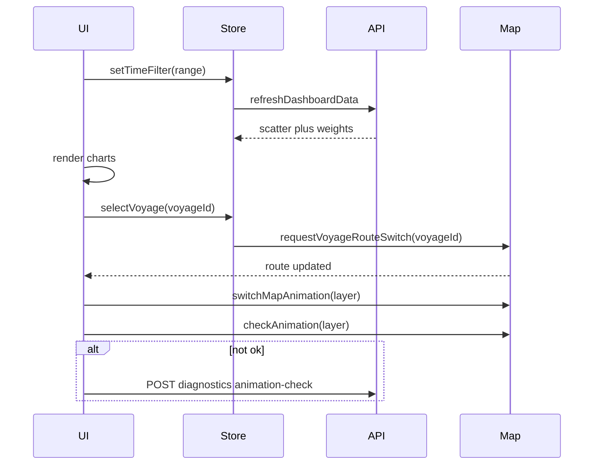

# 航次钻取控制 — 功能文档（负责部分）

本文档仅描述小组分工中**本模块**需要实现与对接的功能：散点图与航线联动、环境指标与动画自检、权重饼图、全局时间过滤时间轴。其他仪表盘能力由其余文档说明。

**配套文档**：[`docs/api-voyage-drilldown.md`](api-voyage-drilldown.md)（HTTP 接口与类型）。

---

## 1. 范围、假设与术语

### 1.1 范围

| 编号 | 能力 | 说明 |
|------|------|------|
| F1 | 散点图 | 纵轴为单次航行船舶总排放量，横轴为航行序号（1,2,3…）；点击点后中央大屏切换对应航线。 |
| F2 | 环境指标 | 风 / 洋流 / 波浪三选一；默认风；切换时驱动中央大屏环境动画，并执行动画自检；异常写入 `check_animation` 记录（经后端持久化）。 |
| F3 | 饼状图 | 依据风/洋流/波浪权重绘制；权重随全局时间过滤变化。 |
| F4 | 时间轴 | 展示最近一周（按自然日）；最小单元为**天**；支持单日选择与按天区间（扩展）；变更后全界面数据刷新。 |

### 1.2 假设

- **前后端分离**：业务数据来自后端 HTTP API（JSON）。
- **地图子系统**：中央大屏的航线渲染、风/洋流/波浪等环境场动画由地图模块（或三维/Canvas 封装）提供；本模块通过**约定函数**或**事件总线**与其交互，不绑定具体地图引擎。
- **单一数据源**：建议前端使用全局 store（Redux / Pinia / Context 等）管理 `timeFilter`、`envLayer`、`selectedVoyageId`，避免多组件状态不一致。

### 1.3 术语

| 术语 | 含义 |
|------|------|
| `voyageId` | 航次唯一标识；全项目统一为 `string`（若后端为数字，前端统一 `String(id)`）。 |
| `voyageIndex` | 展示序号，仅用于散点图横轴（1,2,3…）；必须与 `voyageId` 一一对应（在同一 `timeFilter` 数据集内）。 |
| `envLayer` | 环境图层枚举：`wind`（风）、`current`（洋流）、`wave`（波浪）；与 UI 文案一一对应。 |
| `timeFilter` | 当前仪表盘生效的时间范围；见第 3 节。 |
| `anchorDate` | 时间轴所锚定的「今天」或「数据最新日」，用于划定「最近 7 个自然日」窗口。 |

---

## 2. 全局状态与刷新原则

### 2.1 建议状态结构

```ts
type TimeFilter =
  | { mode: 'single_day'; startDay: string } // YYYY-MM-DD
  | { mode: 'range'; startDay: string; endDay: string }; // 含首尾自然日，见接口文档区间语义

type EnvLayer = 'wind' | 'current' | 'wave';

interface VoyageDrilldownState {
  timeFilter: TimeFilter;
  envLayer: EnvLayer; // 默认 'wind'
  selectedVoyageId: string | null;
}
```

### 2.2 默认值（组内需统一实现）

| 状态 | 默认策略 |
|------|----------|
| `timeFilter` | **最近 7 个自然日窗口**内，取 **`anchorDate` 当天**为初始选中单日。`anchorDate` 建议取**数据最新可用日**；若无「最新数据日」接口，则退化为**本地日历的今天**（时区见 2.3）。 |
| `envLayer` | `wind`。 |
| `selectedVoyageId` | `null`（进入页面未点选散点）。 |

### 2.3 时区

- 所有「自然日」边界（`startDay` / `endDay`）均按 **Asia/Shanghai** 解释并换算为请求参数；若全项目强制 UTC，则以项目总规范为准并在接口文档中统一。

### 2.4 刷新原则

| 事件 | 行为 |
|------|------|
| `timeFilter` 变化 | 必须调用 **`refreshDashboardData(timeFilter)`**（见第 6 节），刷新所有依赖时间的面板数据（含散点、饼图及本组负责范围内其它图表）。 |
| `selectedVoyageId` 变化 | **不**因时间刷新自动变更航线以外的业务数据；仅触发地图航线切换（见第 4 节）。可选：并行请求航次详情供其他面板使用（非本功能文档必选）。 |
| `envLayer` 变化 | 调用地图侧 `switchMapAnimation` 与 `checkAnimation`（见第 5 节）；**不**自动改变 `timeFilter`。 |

### 2.5 首屏加载顺序（推荐，减少竞态）

进入大屏页时建议按以下顺序执行（可与地图初始化部分重叠，但**逻辑依赖**如下）：

1. 确定初始 `timeFilter`（见 2.2）并调用 **`refreshDashboardData(timeFilter)`**，使散点图、饼图等有数据可渲染。
2. 等待地图子系统**就绪**（首帧可交互）后，再执行 **第 5.2 节** 的 `switchMapAnimation('wind')` → `checkAnimation('wind')` 流程。

若地图就绪早于数据返回：可先显示地图底图与加载态图表；**勿**在数据未返回前依赖散点点击切换航线（此时无有效 `voyageId` 列表）。

---

## 3. 时间过滤（timeFilter）语义

### 3.1 展示窗口

- 时间轴 UI **固定展示**最近 **7** 个连续自然日：  
  `[anchorDate - 6d, anchorDate]`（与 `anchorDate` 同日包含在内，共 7 天）。
- `anchorDate` 的取值策略见 2.2。

### 3.2 交互模式

| 模式 | 用户操作 | `timeFilter` |
|------|----------|--------------|
| **单日（默认）** | 点击某一天 `D` | `{ mode: 'single_day', startDay: D }` |
| **区间（扩展）** | 选择起止日 `D1`、`D2`（`D1 <= D2`，粒度为天） | `{ mode: 'range', startDay: D1, endDay: D2 }` |

单日模式可视为 `D1 = D2 = D` 的特例；实现上可合并为 range，但本组对外契约以 `mode` 区分，便于接口传参。

### 3.3 时间变更后的选中航次策略

`timeFilter` 变化并完成后端数据刷新后：

1. **推荐默认**：清空 `selectedVoyageId`，并轻提示「时间范围已变更」或等价文案。
2. **可选**：若需保留选中，则当新散点数据集中**不存在**当前 `selectedVoyageId` 时，强制置为 `null` 并提示。

组内任选其一，全项目保持一致。

---

## 4. 功能 F1：散点图与中央大屏航线联动

### 4.1 展示

- **横轴**：`voyageIndex`（1,2,3…）。
- **纵轴**：该航次船舶**总排放量** `totalEmission`；单位由后端 `emissionUnit` 字段给出，图例须显示单位。

### 4.2 数据要求

每个散点至少包含：`voyageId`、`voyageIndex`、`totalEmission`；可选 `label`（tooltip）。

**`voyageIndex` 编号策略（组内固定一种）**

- **默认**：在当前 `timeFilter` 对应数据集内，`voyageIndex` 为 **1 起连续正整数**，与 `items` 排序一致。
- **若业务存在跳号**：允许不连续，横轴仍使用后端给出的 `voyageIndex` 原值；后端须在接口响应或说明中保证 **`voyageId` 与 `voyageIndex` 在该次查询内唯一对应**，避免同序号对应多航次。

### 4.3 交互

- 用户点击某一散点：**立即**将中央大屏航线切换为该点对应 `voyageId` 的航线。
- 更新顺序建议：先更新 store 中 `selectedVoyageId`，再调用 **`requestVoyageRouteSwitch(voyageId)`**，保证地图与侧栏状态一致。

### 4.4 抽象函数契约（地图侧）

```ts
type VoyageId = string;

/** 向地图子系统请求切换当前展示的航线；应尽快触发渲染更新（可在下一帧完成几何加载）。 */
function requestVoyageRouteSwitch(voyageId: VoyageId): void;
```

**实现方式（二选一，组内统一）**

1. **事件总线**：`eventBus.emit('map:route:set', { voyageId })`  
2. **地图适配器**：`mapAdapter.showVoyageRoute(voyageId)`

地图模块根据 `voyageId` 自行拉取或订阅几何数据（通常由 `GET /api/voyages/{voyageId}/route`，见接口文档）。若路由请求失败或当前 `timeFilter` 下无几何：

- 地图进入**空态/错误提示**（例如「该航次暂无航线数据」），且不清除用户选中语义（由产品决定）；至少需可区分「无数据」与「加载中」。

### 4.5 失败态

- 网络错误：散点或航线接口失败时，图表与地图分别展示重试入口或 toast；`selectedVoyageId` 与地图状态需一致，避免「点了点但地图未变」且无反馈。

---

## 5. 功能 F2：环境指标与 `check_animation`

### 5.1 UI

- 三个 pill：**风** → `wind`，**洋流** → `current`，**波浪** → `wave`。
- **默认选中**：风（`envLayer = wind`）。

### 5.2 初始化顺序（必须严格执行）

在**地图子系统就绪**后（首帧可交互或路由进入大屏页后）：

1. `switchMapAnimation('wind')` — 即使默认已是风，也需显式调用一次，保证内部图层状态与 UI 一致。
2. `await checkAnimation('wind')`。
3. 若 `ok === false`，调用 `recordAnimationCheckFailure({ layer: 'wind', reason, ... })`（见 5.5）。

### 5.3 用户切换环境

用户点击某一环境 pill（与当前不同或相同均可，建议相同则短路不重复切换）：

1. 更新 `envLayer` 与 UI 选中态。
2. `switchMapAnimation(envLayer)`。
3. `await checkAnimation(envLayer)`。
4. 若 `ok === false`，`recordAnimationCheckFailure(...)`。

### 5.4 抽象函数契约

```ts
type EnvLayer = 'wind' | 'current' | 'wave';

interface AnimationCheckResult {
  ok: boolean;
  reason?: string;
}

/** 切换中央大屏环境场动画（粒子/矢量箭头/贴图等），由地图实现。 */
function switchMapAnimation(layer: EnvLayer): void;

/**
 * 检查当前 layer 对应动画是否「已按预期开启」。
 * 实现归属：地图子系统；若短期内无法做真实帧检测，允许降级为「资源已加载且图层可见」等工程判定，须在 README/联调说明中声明，避免静默假阳性。
 */
function checkAnimation(layer: EnvLayer): Promise<AnimationCheckResult>;
```

### 5.5 诊断记录 `recordAnimationCheckFailure`

前端**不**直接写入仓库内 JSON 文件；通过 **HTTP API** 交由后端写入 `check_animation.json`（或等价存储）。语义：

```ts
function recordAnimationCheckFailure(payload: {
  layer: EnvLayer;
  ok: false;
  reason?: string;
  timeFilter: TimeFilter;
  selectedVoyageId?: string | null;
  clientBuild?: string;
}): Promise<void>;
```

仅当 `checkAnimation` 返回失败时调用；成功时不写诊断文件（除非项目组另有审计需求）。

### 5.6 持久化说明

- 文件路径、并发写入策略以后端实现为准；前端只关心 `POST` 成功与失败提示（开发环境可打 console）。
- 记录结构见《数据接口文档》中 `check_animation.json` 与诊断接口说明。

**诊断接口失败时的用户侧策略**

- **正式演示 / 生产**：`recordAnimationCheckFailure` 对应的 `POST` 若失败，**不对最终用户弹阻塞式错误**；可写日志、上报监控或仅在开发环境 toast。
- **开发联调**：失败时可 toast 或 console 明确提示，便于排查网络与后端写入。

---

## 6. 功能 F3：饼状图（风 / 洋流 / 波浪权重）

### 6.1 展示

- 三块扇区对应 `wind`、`current`、`wave`。
- 若权重和不为 1，前端按接口文档约定做归一化后绘制。

### 6.2 数据依赖

- 权重**仅**随 **`timeFilter`** 变化而刷新（调用 `refreshDashboardData` 时一并获取）。
- **默认不包含**随 `selectedVoyageId` 变化；若产品需要「点选航次后展示该航次解释性权重」，须作为**单独开关**扩展，并在接口上增加 `voyageId` 可选参数（见接口文档可选说明）。

---

## 7. 功能 F4：可互动时间轴

### 7.1 布局与交互

- 置于页面底部（或产品指定区域）；与全局 `timeFilter` 双向绑定。
- 用户操作：**单日**或 **起止日区间**（扩展），最小粒度均为自然日。

### 7.2 数据刷新函数

```ts
/**
 * 时间过滤变更后调用：拉取散点、饼图权重及所有依赖 timeFilter 的模块数据，并原子更新 store。
 * 实现可并行请求多个 GET，或调用聚合接口 GET /api/dashboard/snapshot（若后端提供）。
 */
function refreshDashboardData(timeFilter: TimeFilter): Promise<void>;
```

刷新完成后执行第 3.3 节的 `selectedVoyageId` 策略。

---

## 8. 与其它模块的输入输出关系（集成表）

| 产出方 | 数据/事件 | 消费方 | 说明 |
|--------|-----------|--------|------|
| 时间轴 | `timeFilter` | 散点图、饼图、后端查询参数 | 全局过滤；变更触发 `refreshDashboardData`。 |
| 散点图 | `selectedVoyageId` | 地图（`requestVoyageRouteSwitch`） | 点击散点更新；时间变更可能清空。 |
| 环境 pill | `envLayer` | 地图（`switchMapAnimation` / `checkAnimation`） | 不触发全量数据刷新。 |
| 地图自检失败 | `recordAnimationCheckFailure` | 后端 `check_animation` | 仅失败路径。 |
| 后端 | 散点/权重/航线几何 | 图表与地图 | 见接口文档。 |

### 8.1 timeFilter 对各面板的影响

| 面板 | 是否随 timeFilter 刷新 |
|------|------------------------|
| 散点图（排放–序号） | 是 |
| 饼图（权重） | 是 |
| 中央地图航线 | 仅当用户点击散点或 `selectedVoyageId` 仍有效时需重新拉航线/对齐；时间变更后按 3.3 清空或校验选中项 |

### 8.2 请求/调用关系（函数级）

```
refreshDashboardData(timeFilter)
  → GET 散点、GET 权重（或 snapshot）
  → 更新 store → 重绘散点图、饼图

onScatterPointClick(voyageId)
  → set selectedVoyageId
  → requestVoyageRouteSwitch(voyageId)
  → （可选）GET 航线若由地图外容器拉取

onEnvPillClick(layer)
  → set envLayer
  → switchMapAnimation(layer) → checkAnimation(layer)
  → 若 !ok → recordAnimationCheckFailure(...)

onTimeFilterChange(tf)
  → set timeFilter
  → refreshDashboardData(tf)
  → 处理 selectedVoyageId（3.3）
```

---

## 9. 关键时序（插图）



---

## 10. 非功能要求（建议）

- **响应**：点击散点后地图应在用户可感知范围内尽快反馈（加载态 + 成功/失败）。
- **一致性**：`envLayer` 与地图实际展示不一致时，以一次完整 `switchMapAnimation` + `checkAnimation` 流程为准进行修复。
- **可测试性**：`checkAnimation` 的降级策略需可配置或在构建时注入，便于 CI 跳过真实 WebGL。

---

*文档版本：与《航次钻取控制 — 数据接口文档》配套使用。*
